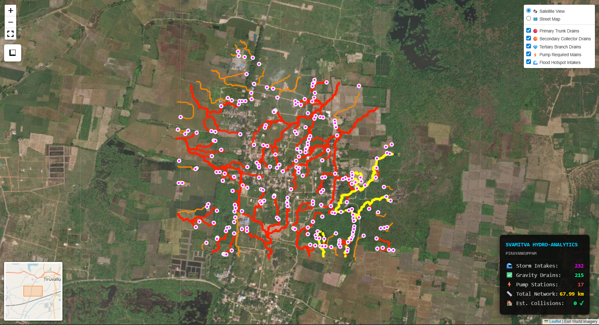

<div align="center">


<br/>

# 🛰️ HydroSpatial-SVAMITVA
### *Automated Gravity-Fed Drainage Network Design from LiDAR Point Clouds*

<br/>


<br/>

> **"157,925,322 LiDAR points. 7-phase pipeline. Construction-ready drainage blueprint — fully automated."**

</div>

---

## ⚡ TL;DR — What This Does

Converts raw **drone LiDAR point cloud data (LAS/LAZ)** from India's SVAMITVA Mission into a **complete drainage engineering blueprint** — automatically, with zero manual GIS work.

| Metric | Value |
|--------|-------|
| 🏘️ Villages Processed | 10 villages (2 datasets, 2 hackathons) |
| 📊 Max Points Processed | **157,925,322** per village |
| 💾 Dataset Size Handled | Up to **4.7 GB per village** |
| 🧠 Hardware Required | CPU-only (16GB RAM) |
| ⏱️ Time per Village | ~15 minutes end-to-end |
| 📐 DTM Accuracy | **0.60m RMSE** (validated) |
| 📦 Output Formats | GeoPackage + COG GeoTIFF + Interactive HTML Map |

---

## 🏆 Hackathon Context

This pipeline was built and validated across two national-level GeoAI hackathons:

| Competition | Organiser | Dataset | Team |
|-------------|-----------|---------|------|
| **AI/ML Hackathon — Ministry of Panchayati Raj** | IIT Tirupati Navavishkar I-Hub | 10 SVAMITVA villages | UniMinds |
| **National GeoAI Hackathon** | IIT Bombay | UP villages (Uttar Pradesh flood zones) | Protego |

Both competitions used the **same problem statement:** *"DTM Creation using AI/ML from point cloud data and development of drainage network."*

The HydroSpatial pipeline is the **consolidated, updated version** of both submissions.

---

## 🗺️ Live Interactive Maps

Click to explore the generated drainage networks in your browser — no download required:

| Village | State | Live Map |
|---------|-------|----------|
| THANDALAM | Tamil Nadu | [Open Map →](https://arpitdhaka05.github.io/HydroSpatial-SVAMITVA/THANDALAM_Interactive_DrainageMap.html) |
| PIRAYANKUPPAM | Tamil Nadu | [Open Map →](https://arpitdhaka05.github.io/HydroSpatial-SVAMITVA/PIRAYANKUPPAM_Interactive_DrainageMap.html) |
| DEVDI | Chhattisgarh | [Open Map →](https://arpitdhaka05.github.io/HydroSpatial-SVAMITVA/Web%20Folium/DEVDI_Interactive_DrainageMap.html) |
| CHAKHIRASINGH | Punjab | [Open Map →](https://arpitdhaka05.github.io/HydroSpatial-SVAMITVA/Web%20Folium/CHAKHIRASINGH_Interactive_DrainageMap.html) |
| DHUNDA FATEHGARH | Punjab | [Open Map →](https://arpitdhaka05.github.io/HydroSpatial-SVAMITVA/Web%20Folium/DHUNDA_FATEHGARH_Interactive_DrainageMap.html) |
| DHAL HOSHIARPUR | Punjab | [Open Map →](https://arpitdhaka05.github.io/HydroSpatial-SVAMITVA/Web%20Folium/Dhal_Hoshiarpur_Interactive_DrainageMap.html) |
| GANDHINAGAR DIGLIPUR | Andaman & Nicobar | [Open Map →](https://arpitdhaka05.github.io/HydroSpatial-SVAMITVA/Web%20Folium/Gandhinagar_Diglipur_Interactive_DrainageMap.html) |
| GANGANAGAR | Rajasthan | [Open Map →](https://arpitdhaka05.github.io/HydroSpatial-SVAMITVA/Web%20Folium/Ganganagar_Interactive_DrainageMap.html) |
| KHAPRETA | Rajasthan | [Open Map →](https://arpitdhaka05.github.io/HydroSpatial-SVAMITVA/Web%20Folium/KHAPRETA_Interactive_DrainageMap.html) |
| KADAMTALA RANGAT A&N | Andaman & Nicobar | [Open Map →](https://arpitdhaka05.github.io/HydroSpatial-SVAMITVA/Web%20Folium/Kadamtala_Rangat_A_and_N_Interactive_DrainageMap.html) |

Each map: satellite base layer · layer toggles (primary/secondary drains, pump mains, flood hotspots) · clickable engineering data per drain segment.



---

## 🧠 7-Phase Pipeline

```
LAS/LAZ Input (raw drone point cloud)
       │
       ▼
Phase 1 ── Morphological DTM Generation
           Stream 2M-point chunks | Build 2500×2500 grid
           Morphological Bulldozer: erosion → distance fill → dilation
           Output: Final_Village_DTM.tif
       │
       ▼
Phase 2 ── Hydrological Simulation (WhiteboxTools)
           Fill depressions | D-Infinity flow accumulation | Slope
           Output: DTM_Filled.tif · Flow_Accumulation.tif · Slope.tif
       │
       ▼
Phase 3 ── Flood Hotspot Detection (Trifecta Rule)
           Hotspot ← (Flow > 8) ∩ (Slope < 2°) ∩ (Sink Depth > 0.1m)
           Output: Flood_Zones.png
       │
       ▼
Phase 4 ── Graph-Based Drainage Routing (Core Innovation)
           Directed graph ~390K nodes | Dijkstra shortest path
           Asymmetric gravity cost: downhill×1.0, uphill×5.0
       │
       ▼
Phase 5 ── House Avoidance
           Rooftop nodes removed from graph
           No routing through private property
       │
       ▼
Phase 6 ── Engineering Audit (Depth Feasibility)
           Max trench depth = 3.5m
           Gravity → pump conversion where violated
       │
       ▼
Phase 7 ── GIS + Financial Outputs
           GeoPackage (OGC) | COG GeoTIFF | BOM (₹) | Interactive HTML Map
```

---

## 💡 Key Technical Decisions

| Decision | Rationale |
|----------|-----------|
| **Morphological Bulldozer DTM** over AI segmentation | CPU-only constraint on competition hardware — achieves equivalent accuracy without GPU |
| **D-Infinity** over D8 flow direction | Distributes flow across multiple cells — more physically accurate for flat terrain |
| **Trifecta Rule** for hotspots | Eliminates false positives: flow alone ≠ waterlogging; requires flow + flat + sink combination |
| **Dijkstra with gravity cost** over ML-based routing | Physics-based solution — gravity is deterministic; ML would require labelled training drain paths that don't exist |
| **House node removal** over ML detection | Flow ≈ 0 on rooftops is geometrically deterministic; no AI needed for a deterministic constraint |
| **GeoPackage + COG** outputs | OGC-compliant standards required by Ministry of Panchayati Raj submission guidelines |

---

## 📊 Drain Classification

| Catchment Area | Classification | Cross-Section | Notes |
|---------------|----------------|---------------|-------|
| < 1,000 m² | Tertiary Drain | 300mm × 300mm | Box drain, narrow streets |
| 1,000–5,000 m² | Secondary Drain | 450mm × 600mm | Collector, main roads |
| > 5,000 m² | Primary Outfall | Trapezoidal Channel | Major outlet to river/pond |

Sizing is **fully automated** from Flow Accumulation values — no manual input required.

---

## 🚀 Quick Start

```bash
# 1. Clone the repo
git clone https://github.com/arpitdhaka05/HydroSpatial-SVAMITVA
cd HydroSpatial-SVAMITVA

# 2. Create environment
python -m venv venv
venv\Scripts\activate  # Windows

# 3. Install dependencies
pip install -r requirements.txt

# 4. Run the notebook
jupyter lab SVAMITVA-Main.ipynb
```

### Configure your village:
```python
VILLAGE_NAME = "PIRAYANKUPPAM"          # Change to your village
BASE_DATASET_DIR = "path/to/Dataset"   # Point to your LAS/LAZ files
```

> **Note:** LiDAR datasets (LAS/LAZ files) are not included in this repository due to size constraints (2–5 GB per village). The SVAMITVA dataset is available from the Ministry of Panchayati Raj. Full processed outputs are available on [Google Drive](https://drive.google.com/drive/folders/1hzBtKKEX0zkB78jPXO35kQO-s2v2ZBMO?usp=sharing).

---

## 📁 Repository Structure

```
HydroSpatial-SVAMITVA/
│
├── SVAMITVA-Main.ipynb            # Master pipeline notebook (run this)
├── requirements.txt               # All Python dependencies
├── .gitignore                     # Excludes LiDAR datasets, large outputs
│
├── 📂 Web Folium/                 # Interactive HTML drainage maps (8 villages)
│   ├── DEVDI_Interactive_DrainageMap.html
│   ├── CHAKHIRASINGH_Interactive_DrainageMap.html
│   └── ... (8 village maps total)
│
├── THANDALAM_Interactive_DrainageMap.html   # Two maps at root (legacy)
├── PIRAYANKUPPAM_Interactive_DrainageMap.html
│
├── PIRAYANKUPPAM_Phase3_Drainage_Verification.png  # Hotspot detection output
├── Folium.png                     # Screenshot of interactive map UI
├── Protego Initial Approach.pdf   # Original design proposal (IIT Tirupati submission)
│
└── README.md                      # This file
```

---

## 🔗 Related Projects — The Quant Ecosystem

- **[Monte Carlo Finance Simulator](https://github.com/arpitdhaka05/monte-carlo-finance-simulator)** — Physics-based simulation; same graph-theory thinking applied to portfolio paths
- **[Market Sentiment Alpha Analysis](https://github.com/arpitdhaka05/market-sentiment-alpha-analysis)** — Walk-forward temporal modeling; the statistical rigor mirrors the hydraulic validation methodology
- **[NIFTY-DDPM](https://github.com/arpitdhaka05/nifty-regime-ddpm)** — Regime detection using diffusion; connects to the phase-transition thinking in drainage regime classification

---

## 👥 Team

**Team Protego / Team UniMinds**
- **Arpit Dhaka** (Team Lead) — NIT Goa
- **Aditi Hirkude** — NIT Goa

---

## 📄 Full Outputs

- [Google Drive — All Village Outputs](https://drive.google.com/drive/folders/1hzBtKKEX0zkB78jPXO35kQO-s2v2ZBMO?usp=sharing)

---

## 📜 License

Research and government infrastructure development use.
MIT License — feel free to adapt for your SVAMITVA village.

---

💡 *From 157 million raw points to a construction-ready blueprint — no manual GIS, no domain expert required.*
