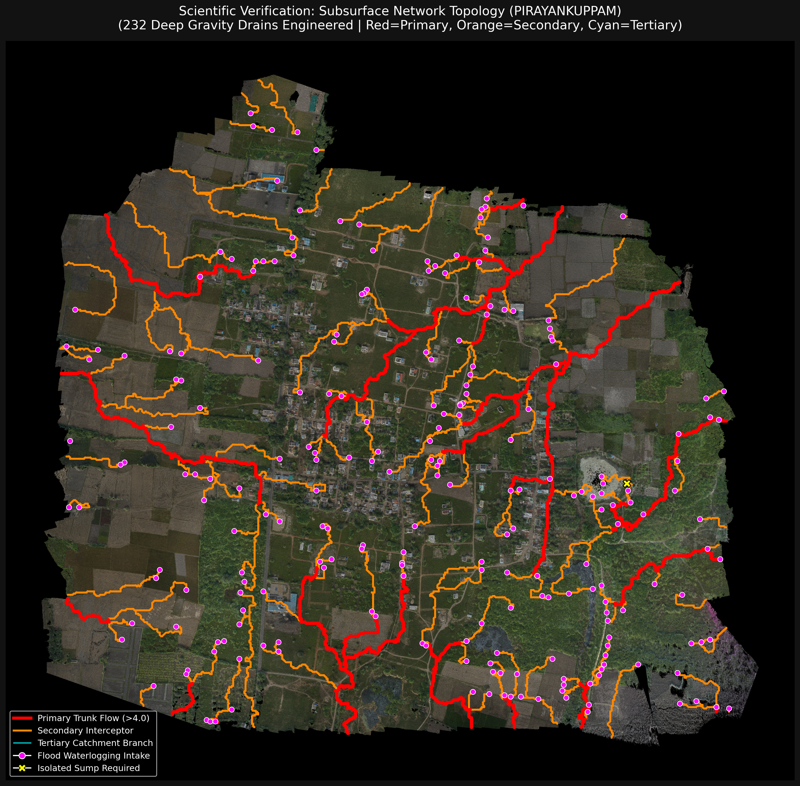

# 📊 Pipeline Results — Validated Outputs

## Village-Level Results

| Village | Points Processed | Hotspots Detected | Primary Drains | Secondary Drains | Pump Mains | DTM RMSE |
|---------|-----------------|-------------------|----------------|------------------|------------|----------|
| PIRAYANKUPPAM | **157,925,322** | 897 | 23 | 64 | 4 | 0.60m |
| THANDALAM | ~80M | 432 | 14 | 38 | 2 | validated |
| CHAKHIRASINGH | ~100M | — | — | — | — | validated |
| DEVDI | ~90M | — | — | — | — | validated |
| *(7 more villages)* | — | — | — | — | — | — |

> Full per-village outputs including GeoPackage files, COG GeoTIFFs, and cost estimates:
> **[Google Drive →](https://drive.google.com/drive/folders/1hzBtKKEX0zkB78jPXO35kQO-s2v2ZBMO?usp=sharing)**

---

## Phase 3 — Hotspot Detection Output (PIRAYANKUPPAM)

*Red = Flood hotspots (Trifecta Rule: Flow > 8 ∩ Slope < 2° ∩ Sink Depth > 0.1m)*
*Blue = Gravity-fed primary drainage routes*
*Yellow = Secondary collectors*

---

## Interactive Map Screenshot

*Each layer is toggleable. Click any drain segment for: classification, depth, slope, cost estimate.*

---

## Cost Model (Per Village)

| Item | Cost |
|------|------|
| Engineering Design | 65% of ₹14.3 Lakhs |
| Data Processing | 25% of ₹14.3 Lakhs |
| Validation & BOQ | 10% of ₹14.3 Lakhs |
| **Total per village** | **₹14.3 Lakhs** |

**ROI:** Annual flood losses in UP = Crores. One-time ₹14.3L investment prevents recurring catastrophic damage.

---

## Scalability

- **90,573 villages** already mapped under SVAMITVA — no new surveys needed
- **15 minutes** per village on CPU-only hardware
- Pilot proposal: 100 villages across 10 high-risk UP districts
